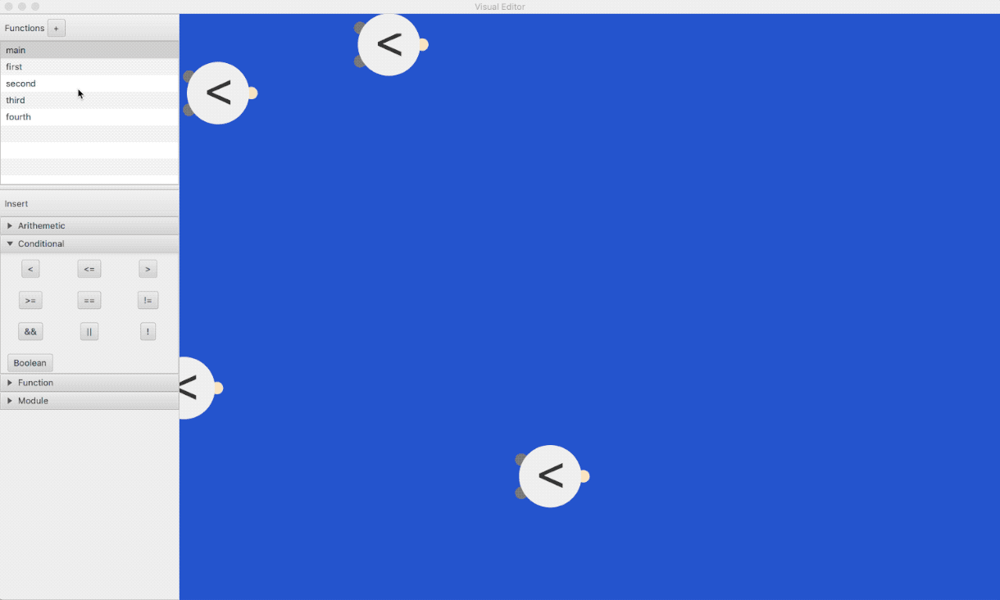
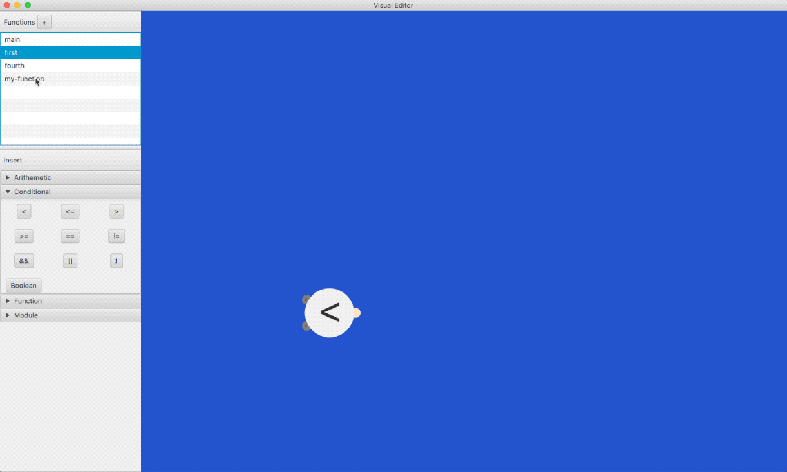
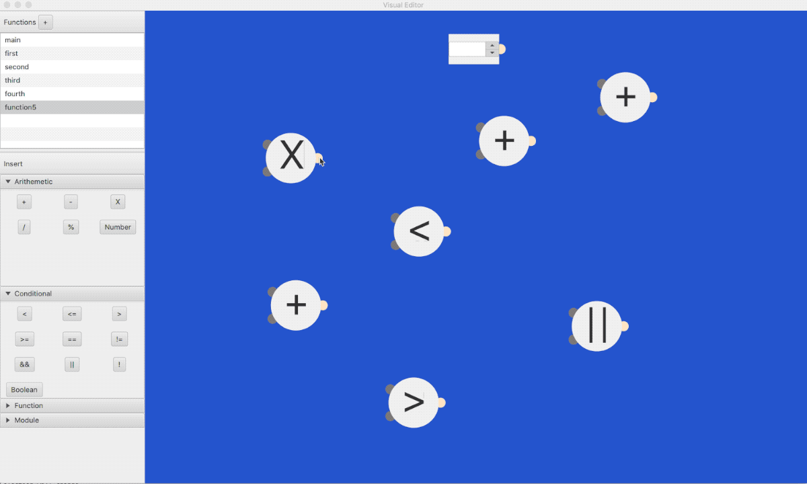
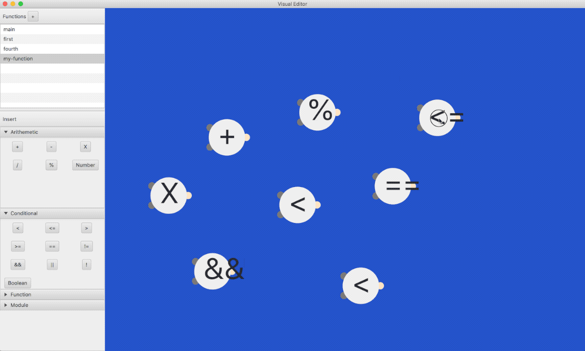

# Visual Editor for Dataflow Programming

This is a JavaFX based visual editor for providing users with a visual environment to
create directed graphs for a dataflow program.

## Introduction:

Dataflow programming is an alternate approach to the mainstream programming paradigms 
seen in most common programming languages. The ideology behind data flow programming 
revolves around directing data through a directed graph represented by nodes and edges.
To achieve this, the editor provides a rich workspace(currently in development) 
capable of delivering all the node creation and manipulation needs. 

## Progress so far:

 There were several requirements and I have managed to meet most of them at this time. 
 Aside from the basic static UI setup, the class architecture has been established and
 several actions are possible. Every user driven event is undoable. Here is a sample 
 walkthrough of the application.
 
 ### Functions
 
 
 ### Node creation and movement
 
 
 ### Type checked node connections
  
 
 ### Undo/Redo
 
 
 The sidebar comprises of two sections, the top part is the list of function definitions
 and the bottom part is the toolset. Function definitions allow users to modularize 
 part of the dataflow diagram and reuse it. Toolset at the bottom of the sidebar is 
 the area that comprises of several node creation buttons.
 
 ## How to run
 
 This is a standalone JavaFX project. The version of JavaFX that this project uses
 comes prepackaged in JDK 1.8. As long as you have JDK 1.8 installed on your machine, 
 running the project should not be an issue. I used IntelliJ IDEA. If you want, 
 you can import the project in that IDE and it should run straight off.